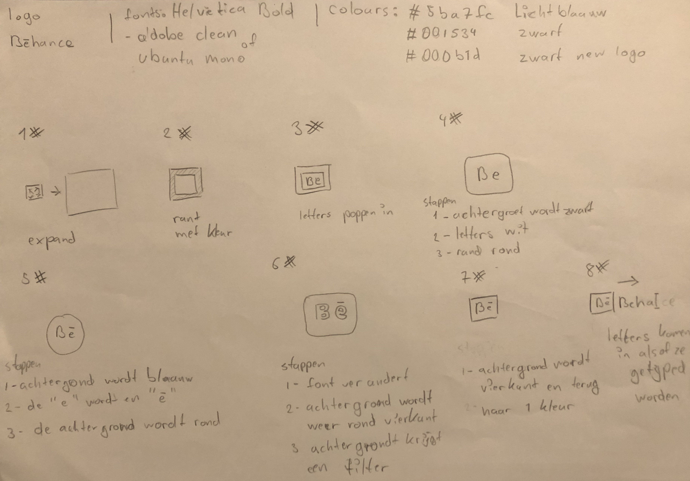
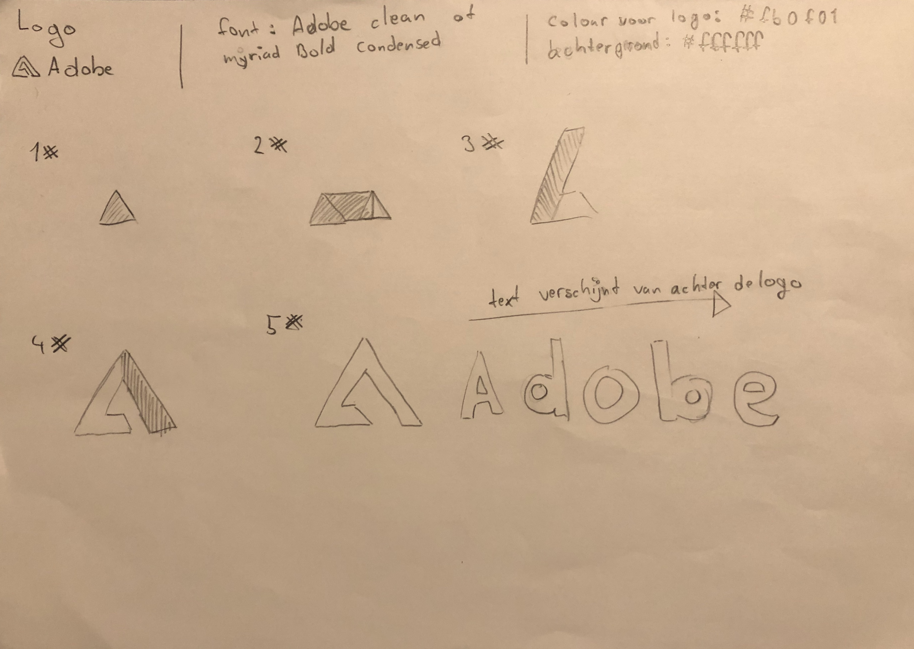
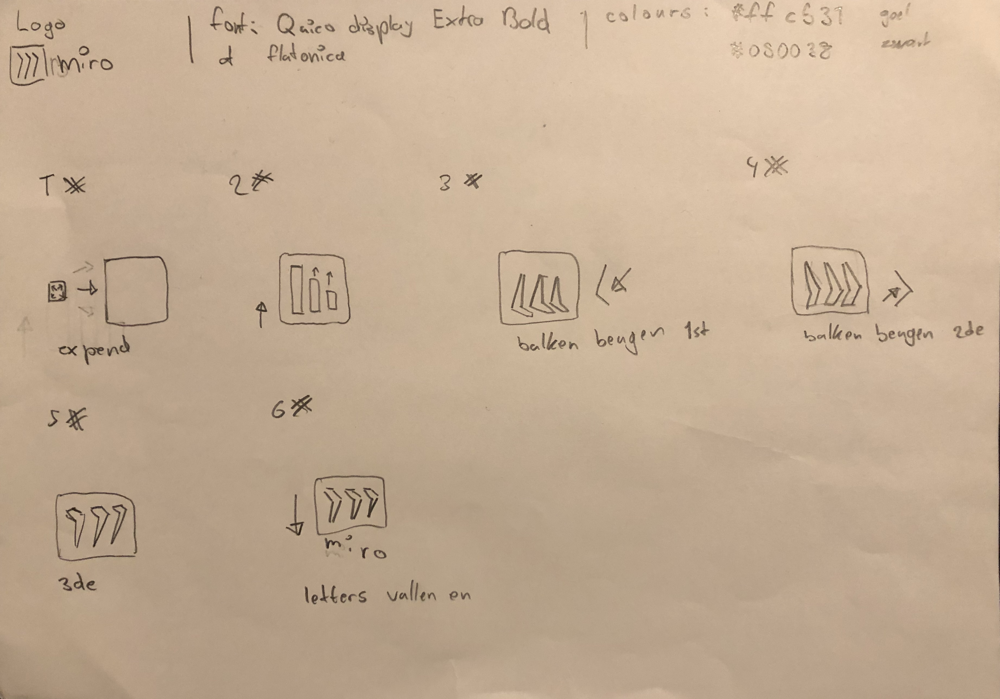
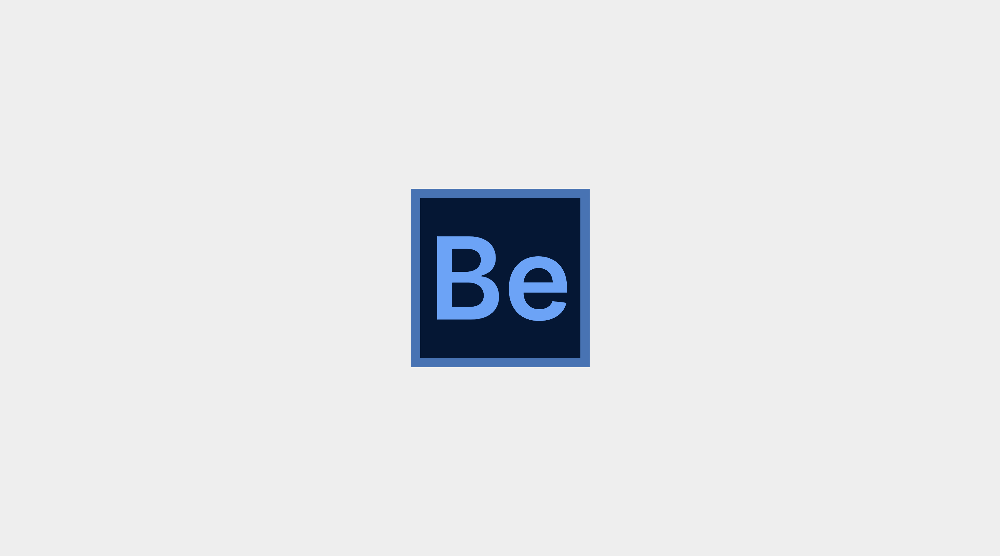
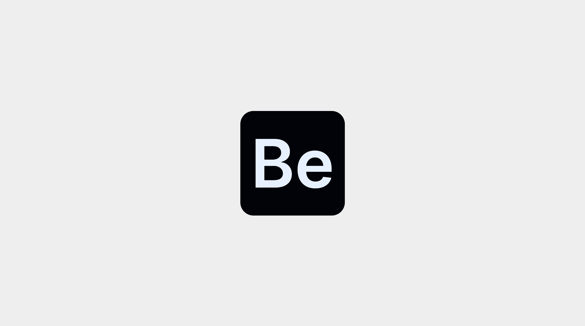
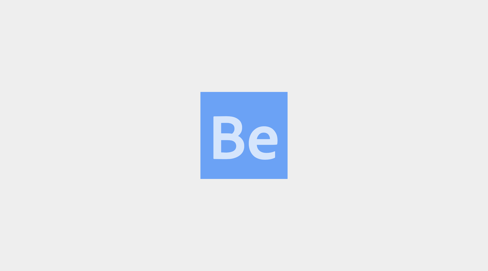
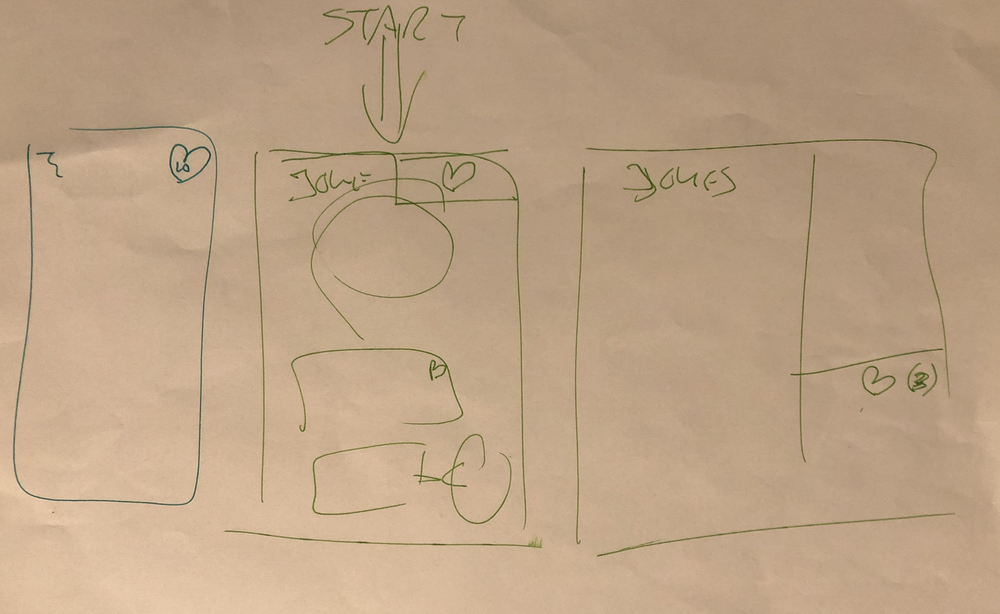
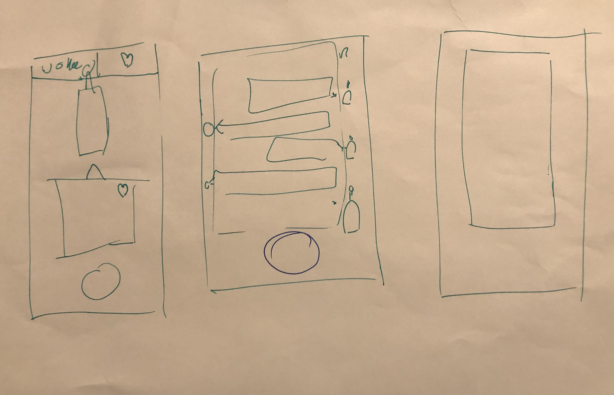
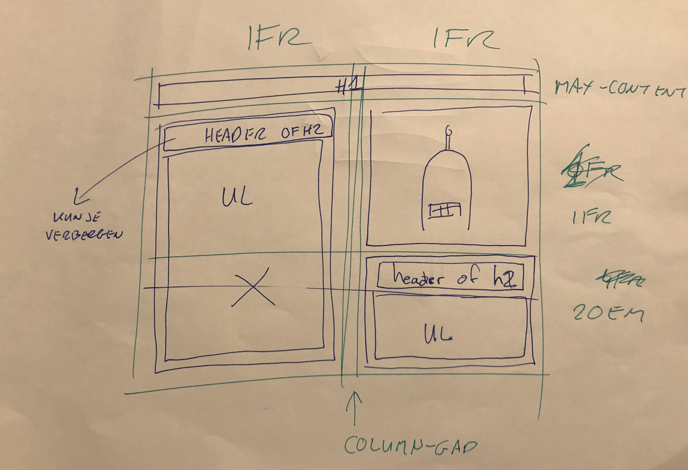

# Procesverslag
**Auteur:** Bryan Ortiz Franco

**De opdrachten:** [opdracht 1](opdracht1/index.html) en [opdracht 2](opdracht2/index.html)

Markdown is een simpele manier om HTML te schrijven.  
Markdown cheat cheet: [Hulp bij het schrijven van Markdown](https://github.com/adam-p/markdown-here/wiki/Markdown-Cheatsheet).

Nb. De standaardstructuur en de spartaanse opmaak van de README.md zijn helemaal prima. Het gaat om de inhoud van je procesverslag. Besteedt de tijd voor pracht en praal aan je website.

Nb. Door *open* toe te voegen aan een *details* element kun je deze standaard open zetten. Fijn om dat steeds voor de relevante stuk(ken) te doen.

## Bronnenlijst
  1. [Behance Logo](https://logos-world.net/behance-logo/)
  2. [Message Appearance inspiration](https://codepen.io/ezenith/pen/pJLypJ)
  3. [Variable fonts](https://fonts.google.com/?vfonly=true)
  4. [Variable fonts guide](https://developer.mozilla.org/en-US/docs/Web/CSS/CSS_Fonts/Variable_Fonts_Guide)
  5. [JokeAPI](https://sv443.net/jokeapi/v2/#try-it)
  6. [SortableJS](https://sortablejs.github.io/Sortable/)
  7. [Inspiratio: Akinator](https://en.akinator.com/)

## Opdracht 1 plan

  
uitwerken na schetsen idee (voor week 2)

  ### Gekozen storyboard: Behance Logo
  

  ### Alternative storyboard: Adobe Logo
  

  ### Alternative storyboard: Miro Logo
  

  ### Je ambitie: 
  Aan deze technieken/punten wil ik werken:
  - Aan mijn CSS animatie skills omdat ik er weinig ervaring mee heb
  - Om te leren variables fonts te gebruiken in animaties

## Opdracht 1 reflectie

  
uitwerken bij afronden opdracht (voor week 4)

  ### Je uitkomst - karakteristiek screenshot(s):
  

  

  

  ### Dit ging goed/Heb ik geleerd: 
  Het variabele lettertype werkt goed tijdens de transacties van de verschillende versies van het logo, ook de animatie loopt goed door en het was meteen heel responsive.

  ### Dit was lastig/Is niet gelukt:
  - Het originele logo heeft een streep op de "e" en ik kon het niet toepassen.
  - Ik heb niet alle logo's kunnen toepassen, maar ben van plan dat in de toekomst te doen voor mijn eigen portfolio.

  
  

## Opdracht 2 plan

  
uitwerken na schetsen idee (voor week 5)

  ### Je ontwerp:
  

  ### Web/Mobile Lay-out schetsen:
  

  

  

  ### Je ambitie: 
  Aan deze technieken/punten wil ik werken:
  - Aan mijn CSS animatie skills verbeteren
  - Werken met API omdat ik niet veel mee gewerkt heb
  - Om een interactive project te maken

## Opdracht 2 test

  
uitwerken na testen (week 7)

  ### Bevinding 1:
  Omschrijving van wat er nog niet orde was (tekst en afbeeding(en)).

  #### oplossing:
  Beschrijving hoe je het hebt hebt opgelost of als het niet gelukt is hoe je het zou oplossen (tekst en afbeeding(en)).

  ### Bevinding 2:
  Omschrijving van wat er nog niet orde was (tekst en afbeeding(en)).

  #### oplossing:
  Beschrijving hoe je het hebt hebt opgelost of als het niet gelukt is hoe je het zou oplossen (tekst en afbeeding(en)).

  ### Bevinding 3:
  Omschrijving van wat er nog niet orde was (tekst en afbeeding(en)).

  #### oplossing:
  Beschrijving hoe je het hebt hebt opgelost of als het niet gelukt is hoe je het zou oplossen (tekst en afbeeding(en)).

  ### Bevinding 4:
  Omschrijving van wat er nog niet orde was (tekst en afbeeding(en)).

  #### oplossing:
  Beschrijving hoe je het hebt hebt opgelost of als het niet gelukt is hoe je het zou oplossen (tekst en afbeeding(en)).

  ### Bevinding 5:
  Omschrijving van wat er nog niet orde was (tekst en afbeeding(en)).

  #### oplossing:
  Beschrijving hoe je het hebt hebt opgelost of als het niet gelukt is hoe je het zou oplossen (tekst en afbeeding(en)).

## Opdracht 2 reflectie

  
uitwerken bij afronden opdracht (voor week 8)

  ### Je uitkomst - karakteristiek screenshot(s):
  

  ### Dit ging goed/Heb ik geleerd: 
  Korte omschrijving met plaatje(s)

  

  ### Dit was lastig/Is niet gelukt:
  Korte omschrijving met plaatje(s)

  

