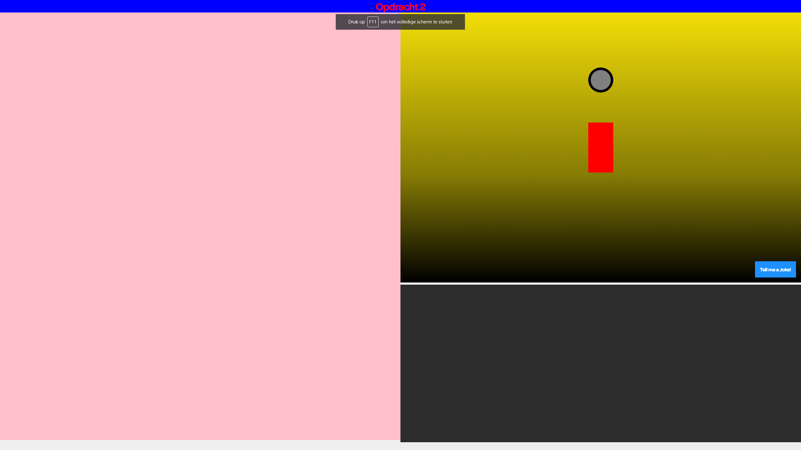

# Procesverslag
**Auteur:** Bryan Ortiz Franco

**De opdrachten:** [opdracht 1](opdracht1/index.html) en [opdracht 2](opdracht2/index.html)

## Bronnenlijst
  1. [Behance Logo](https://logos-world.net/behance-logo/)
  2. [Message Appearance inspiration](https://codepen.io/ezenith/pen/pJLypJ)
  3. [Variable fonts](https://fonts.google.com/?vfonly=true)
  4. [Variable fonts guide](https://developer.mozilla.org/en-US/docs/Web/CSS/CSS_Fonts/Variable_Fonts_Guide)
  5. [JokeAPI](https://sv443.net/jokeapi/v2/#try-it)
  6. [SortableJS](https://sortablejs.github.io/Sortable/)
  7. [Inspiration: Akinator](https://en.akinator.com/)
  8. [Grid Lay-out Generator](https://grid.layoutit.com/)
  9. [Fontsquirrel](https://www.fontsquirrel.com/)

## Opdracht 1 plan

  
uitwerken na schetsen idee (voor week 2)

  ### Gekozen storyboard: Behance Logo
  

  ### Alternative storyboard: Adobe Logo
  

  ### Alternative storyboard: Miro Logo
  

  ### Je ambitie: 
  Aan deze technieken/punten wil ik werken:
  - Aan mijn CSS animatie skills omdat ik er weinig ervaring mee heb
  - Om te leren variables fonts te gebruiken in animaties

## Opdracht 1 reflectie

  
uitwerken bij afronden opdracht (voor week 4)

  ### Je uitkomst - karakteristiek screenshot(s):
  

  

  

  ### Dit ging goed/Heb ik geleerd: 
  Het variabele lettertype werkt goed tijdens de transacties van de verschillende versies van het logo, ook de animatie loopt goed door en het was meteen heel responsive.

  ### Dit was lastig/Is niet gelukt:
  - Het originele logo heeft een streep op de "e" en ik kon het niet toepassen.
  - Ik heb niet alle logo's kunnen toepassen, maar ben van plan dat in de toekomst te doen voor mijn eigen portfolio.

  
  

## Opdracht 2 plan

  
uitwerken na schetsen idee (voor week 5)

  ### Je ontwerp:
  

  ### Web/Mobile Lay-out schetsen:
  

  

  

  ### Je ambitie: 
  Aan deze technieken/punten wil ik werken:
  - Aan mijn CSS animatie skills verbeteren
  - Werken met API omdat ik niet veel mee gewerkt heb
  - Om een interactive project te maken

## Opdracht 2 test

  
uitwerken na testen (week 7)

  ### Bevinding 1:
  Ik probeerde Benders mond te animeren en was van plan het te implementeren met de funties die ik had, maar dat is niet gelukt.

  
  
  

  #### oplossing:
  Dus heb ik het uiteindelijk niet gebruikt omdat het niet goed geplaatst kon worden. Ik heb Benders hoofd een wiebeleffect gegeven om het toch levendigheid te geven.

  

  ### Bevinding 2:
  Ik had mijn pagina layout aan het begin gepositioneerd met postion: absolute, maar dat was een slordige manier omdat te doen.
  
  

  #### oplossing:
  Na wat trial and error en advies van mijn docent kreeg ik het werkend. Ik heb de [Grid Layout Generator] (https://grid.layoutit.com/) gebruikt om dit gemakkelijk en snel te doen.

  
  

  ### Bevinding 3:
  Ik werk sinds kort met Grids, dus ik was blij dat mijn weblayout werkte toen ik hem ging testen. Helaas kwam ik er al snel achter dat het niet responsief was.

  

  #### oplossing:
  Nadat ik de hele dag had geprobeerd het probleem op te lossen, vroeg ik uiteindelijk mijn docent voor hulp om het probleem op te lossen.

  
  

  ### Bevinding 4:
  Ik ben niet de beste met het kiezen van kleuren voor webpagina's. Heel lang heb ik deze lelijke kleuren gebruikt om elementen te scheiden.

  

  #### oplossing:
  Met de hulp van mijn klasgenoot realiseerde ik me laat dat ik gewoon de huiskleuren van de show Futurama kon gebruiken om het bijpassende kleuren aan mijn project te geven.

  
  
  

  ### Bevinding 5:
  Ik moest een andere manier bedenken om de leuke mop in de Saved Jokes Section te zetten. De enige manier die ik had was om hem door te dragen en te droppen.

  

  #### oplossing:
  Uiteindelijk heb ik een like-knop gemaakt waarop de gebruiker ook kan clicken om de grappen op te slaan.

  

## Opdracht 2 reflectie

  
uitwerken bij afronden opdracht (voor week 8)

  ### Je uitkomst - karakteristiek screenshot(s):
  
  
  
  

  ### Dit ging goed/Heb ik geleerd: 
  Ik heb nu een beter begrip van het werken met animaties, grids en met API's. Ik had veel moeite met het begin van het tweede deel van het project omdat ik er weinig ervaring mee had, maar nu kan ik deze vaardigheid beter toepassen voor toekomstige projecten.

  
  

  ### Dit was lastig/Is niet gelukt:
  Helaas is het me niet gelukt om de bewegende mond animatie voor mijn project af te maken. Voorlopig heb ik het hoofd van Bender alleen laten wiebelen om het toch een animatie te geven.

  

## Extra informatie

Markdown is een simpele manier om HTML te schrijven.  
Markdown cheat cheet: [Hulp bij het schrijven van Markdown](https://github.com/adam-p/markdown-here/wiki/Markdown-Cheatsheet).

Nb. De standaardstructuur en de spartaanse opmaak van de README.md zijn helemaal prima. Het gaat om de inhoud van je procesverslag. Besteedt de tijd voor pracht en praal aan je website.

Nb. Door *open* toe te voegen aan een *details* element kun je deze standaard open zetten. Fijn om dat steeds voor de relevante stuk(ken) te doen.